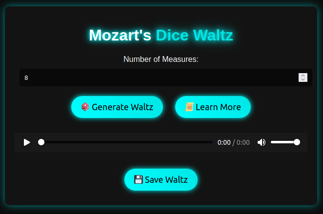
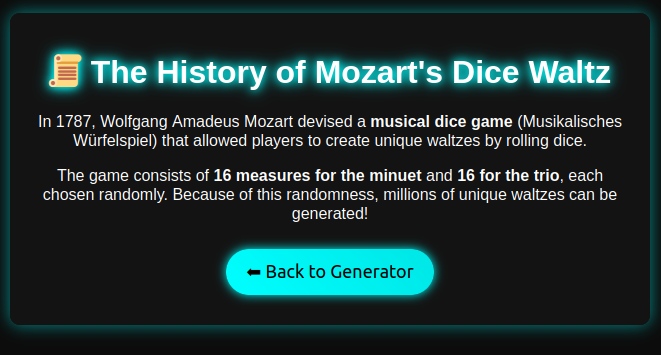

<p align="center">
	
</p>

<h1 align="center">Dice Waltz</h1>

<p align="center">
	<strong>Generate millions of unique Waltzes!</strong>
</p>

> [!NOTE]
> Occasionally, an error will occur: `Uncaught (in promise) RangeError: source array is too long`. Ignore this and click the `Generate Waltz` button again.

## 🚀 Overview

Welcome to **Dice Waltz**! This website allows you to generate millions of unique Waltzes by rolling imaginary dice.

## 🎨 Features

- **Number of Measures:** Select the number of measures for the Waltz (2-16).
- **Aesthetic:** The website is dark themed with a modern and sleek design, along with neon gradients.
- **Save Waltz:** Save the Waltz to your local storage to listen to it later. Each filename is unique to prevent overwriting and to show what musical measure combinations created it.
- **History:** View the history of how the Dice Waltz was originally created by Mozart.

## 🛠️ Installation

1. Click [here](https://introcs.cs.princeton.edu/java/assignments/mozart.zip) to download the `mozart.zip` file which contains the 272 measures of Mozart's Dice Waltz. The download link is from [Princeton University's COS 126 course](https://introcs.cs.princeton.edu/java/assignments/mozart.html).
2. Extract the contents of the `mozart.zip` file.
3. Find the parent directory to the contents of the measures/Waltz segments.
4. Move the parent directory to the root of the project and rename the folder to `segment` as it contains the 272 WAV files, which are the segments needed to produce a Waltz.

## 📈 Usage

To use the program, follow the steps below:

1. Run the following command in the terminal:
```sh
php -S localhost:8000
```

2. Open your browser and go to `localhost:8000`.

3. Click the `Generate Waltz` button to generate a unique Waltz.

## 📸 Screenshots

<p align="center">
	
	
</p>

## 📜 License

[LICENSE](./LICENSE)